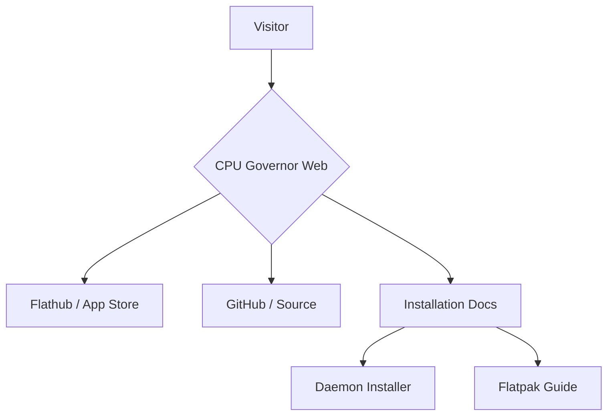

<div align="center">
  
  <h1>CPU Governor Web</h1>
</div>

The official landing page and documentation site for **CPU Governor**, built with React, Vite, and Framer Motion.

[](LICENSE)
[](https://bun.sh)
[](https://vite-pwa-org.netlify.app/)

## Features

- **Multilingual Support** — Available in English, Spanish, Portuguese, Japanese, Chinese, and Italian (`react-i18next`).
- **Interactive Installation Guide** — Unified instructions for the D-Bus daemon, Flatpak, and `.deb` packages.
- **Glassmorphic UI** — A modern, dark-mode-first aesthetic using Tailwind CSS and Framer Motion.
- **PWA Integration** — Installable as a desktop/mobile app for offline reference.
- **Responsive Design** — Optimized for everything from mobile phones to high-res monitors.

## Architecture

This website serves as the primary storefront for the [CPU Governor App](https://github.com/Serverket/cpugov).



## Development

This project uses **Bun** as the primary package manager and toolkit.

### 1. Prerequisites
Ensure you have [Bun](https://bun.sh) installed:
```bash
curl -fsSL https://bun.sh/install | bash
```

### 2. Setup
Clone the repository and install dependencies:
```bash
git clone https://github.com/Serverket/cpugov-web.git
cd cpugov-web
bun install
```

### 3. Development Server
Run the local dev server at `http://localhost:5173`:
```bash
bun run dev
```

### 4. Production Build
Build for production and preview the assets:
```bash
bun run build
bun run preview
```

## Localization (i18n)

Translations are handled via JSON files in `src/i18n/`. To add a new language:
1. Create a new JSON file (e.g., `fr.json`).
2. Register the language in `src/i18n/config.js`.
3. Add the language to the `LANGS` array in `src/components/Navbar.jsx`.

## License

[GPL-3.0-or-later](LICENSE)

## Acknowledgments

*"Whoever loves discipline loves knowledge, but whoever hates correction is stupid."*
